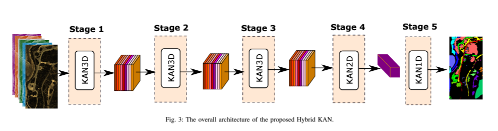
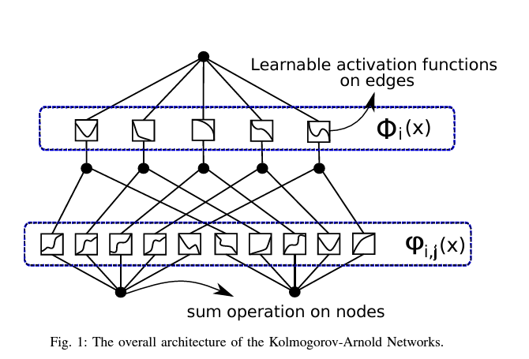
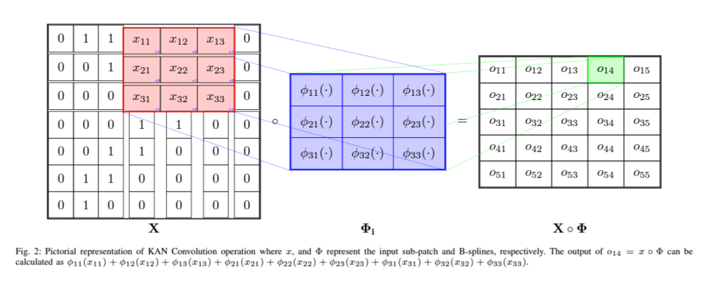

## How to Learn More? Exploring the Possibility of Kolmogorov-Arnold Networks for Hyperspectral Image Classification

[Ali Jamali](https://www.researchgate.net/profile/Ali-Jamali), [Swalpa Kumar Roy](https://swalpa.github.io), [Danfeng Hong](https://sites.google.com/view/danfeng-hong), [Bing Lu](https://www.sfu.ca/people/binglu/about.html), and [Pedram Ghamisi](https://www.iarai.ac.at/people/pedramghamisi/)

___________

This PyTorch code is for the paper Ali Jamali, Swalpa Kumar Roy, Danfeng Hong, Bing Lu, Pedram Ghamisi, "[How to Learn More? Exploring Kolmogorov-Arnold Networks for Hyperspectral Image Classification]," in arXiv, eprint={2406.15719}.

Citation
---------------------

**Please kindly cite the papers if this code is useful and helpful for your research.**

        @misc{jamali2024learn,
                title={How to Learn More? Exploring Kolmogorov-Arnold Networks for Hyperspectral Image Classification},
                author={Ali Jamali and Swalpa Kumar Roy and Danfeng Hong and Bing Lu and Pedram Ghamisi},
                year={2024},
                eprint={2406.15719},
                archivePrefix={arXiv}}

  
Acknowledgement
---------------------

The Efficient KAN is implementated from [EfficientKAN](https://github.com/Blealtan/efficient-kan).
The 3D KAN is implementated from [3DKAN](https://github.com/FirasBDarwish/ConvKAN3D).

## License

Copyright (c) 2024 Ali Jamali. Released under the MIT License. See [LICENSE](LICENSE) for details.

